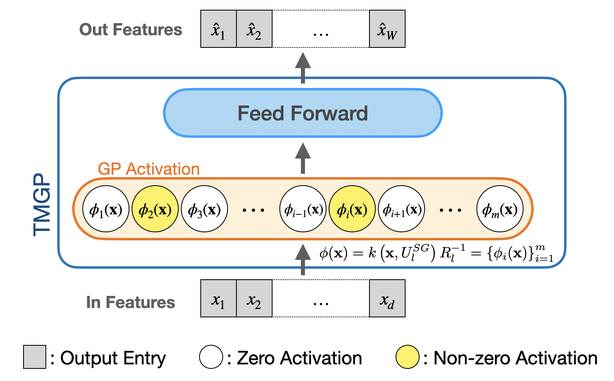

************
Sparse Deep GPs
************

Deep GPs
===================

Suppose :math:`f` is a :math:`H`-layer deep Gaussian processes,

.. math:: f(\cdot) = f^{(H)} \circ \cdots \circ f^{(2)} \circ f^{(1)}(\cdot),

where :math:`f^{(2)} \circ f^{(1)}` denotes the composition 
function :math:`f^{(2)}(f^{(1)}(\cdot))`, :math:`f^{(i)}(\cdot) \sim \mathcal{GP}(\mu(\cdot), k(\cdot,\cdot'))` 
is a GP with mean function :math:`\mu(\cdot)` and kernel function :math:`k(\cdot, \cdot')`, :math:`i=1,\ldots,H`.

We approximate GP :math:`f^{(i)}` by the following finite-rank approximation:

.. math:: \tilde{f}^{(i)}(\cdot) := \mu(\cdot) + k(\cdot, \mathbf{U}) [ k(\mathbf{U}, \mathbf{U})]^{-1} f^{(i)}(\mathbf{U}),

where :math:`\mathbf{U}=\{ \mathbf{u}_i \}_{i=1}^{m}` are the inducing points.

Deep GPs with the sparse grid
===================

Sparse grid
-----------------------

.. image:: ../assets/sparsegrid.png
    :width: 600
    :alt: Sparse grid design of levels 2, 3, 4 in two-dimension

Model
-----------------------

Deep GPs with the additive model
===================

.. image:: ../assets/AMGP.png
    :width: 600
    :alt: Hidden layer architecture of Deep Additive Markov GP (AMGP)