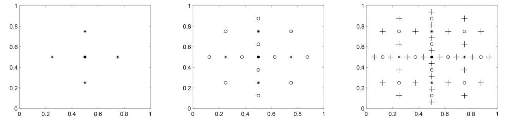
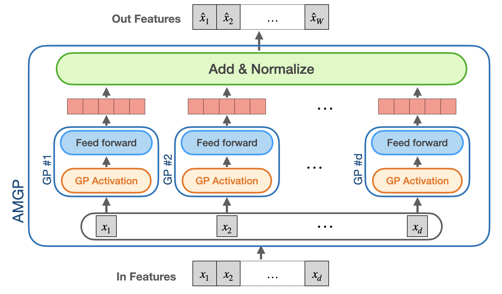

************
Sparse Deep GPs
************

Deep GPs
===================

Suppose :math:`f` is a :math:`H`-layer deep Gaussian processes,

.. math:: f(\cdot) = f^{(H)} \circ \cdots \circ f^{(2)} \circ f^{(1)}(\cdot),

where :math:`f^{(2)} \circ f^{(1)}` denotes the composition function :math:`f^{(2)}(f^{(1)}(\cdot))`, 

Deep GPs with the sparse grid
===================

Sparse grid
-----------------------

Deep GPs with the additive model
===================

